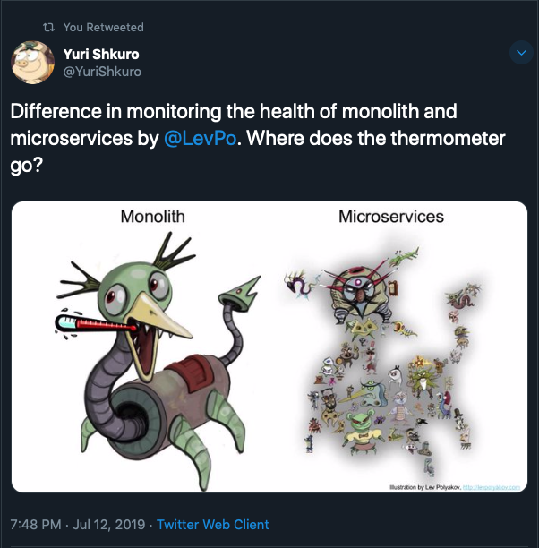

# Microservices

Many organizations have adopted a microservice architecture to deliver their product. This has led to an explosion
of services talking to each other.

Each of these services is likely to have one or more of the following traits:

* Created by / managed by different teams;
* Have it's own logs, possibly using different structures or logging philisophies;
* Have it's own metrics, possibly using different aggregation methods, aggregation periods, sample times, resolution, retention, etc;
* Rely on at *least* one other service.

Given the mess this becomes how do we troubleshoot things that affect customers (slowdowns, incidents, etc)?

* What services were involved in the request?
* What did each service do with the request?
* What did each service do when processing the request?
* Which service took the most processing time to complete the request?
* What does normal proccessing time look like across all services?
* What related background jobs were spawned for the request?
* Which service caused the request to fail?
* What are the critical paths for any request?
* Who should be paged for this?

[This tweet sums](https://twitter.com/YuriShkuro/status/1149873103528484864?s=20) it up perfectly.

Let me start by saying that it's possible to use *just* logs and metrics to answer the questions above.
I've done it.
I know of hundreds of engineers who have and continue to do so as well.
*Most* engineers and ops people are probably in this position.

But it's time consuming, fraught with sharp edges, and nasty surprises.
